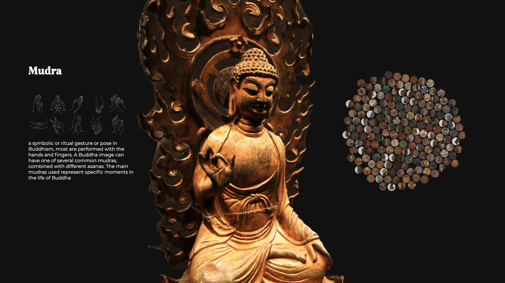

# WhatMakesABuddha

## Key Question answered
How many features must a Buddha has, before you call him Buddha?

## Concept
In Buddhism art, the image of the historical Buddha is often labeled “Shakyamuni”. This distinguishes the image of the historical Buddha, or cosmic buddhas, bodhisattvas, or other divine beings. Buddha images vary greatly from place to place and period to period, but they almost always show some conventional features. So this interactive piece aims to visualize those universal features that a Buddha contains. The bubble groups give you an idea of the Buddhism art collections from the Smithsonian.  By using a 3D sculpture, I want to mimic an immersive experience like you are standing inside a museum, like the National Museum of Asian Art, Smithsonian. 

### About Buddha(Shakyamuni):
Shakyamuni Buddha is the founder of the Buddhist religion. He lived and taught in India in the sixth century B.C.E., a time of burgeoning religious and philosophical thought from Greece to China. Born as the crown prince of the great Shakya Kingdom, the young Siddhartha Gautama was groomed to be a king in accordance with the wishes of his royal father. However, when he was about 29 years old, he learned of the deep suffering experienced in life by people. He left his palace life, gave up his fine garments and jewelry in order to find the causes of this suffering and the means to overcome it. After about six years of study, self-deprivation, and deep meditation he finally realized his goal. He had become an enlightened one (a Buddha)

## Inspirations
[How to Dress for Space](https://www.washingtonpost.com/graphics/2019/business/immersive-space-suits-history-fashion-and-function/)

 ## Preliminary Sketches

## Data Processing
All my datasets are relatively small with no more than 100 instaces, collected them individually with a continuous index number to select later
And I should admit that I did a lot manual work to get data ready for visualize. for example the classification of the medium in art history is particularly detailed. And im very into crop out part of the images

## Programming
Try to work with Three.js. Downloaded a 3d model online and make the angel changes with the xy position. Notice this time it is 3D, so I have, x,y,z,rx,ry to adjust. Do not really follow the logic here, can only try out the numbers to see if the model's been rotated into the right position for presenting. 

### Still a lot to improve
- The files been organized in a messy way to make the github page work
- Should add a minuture view of the Buddha, so the viewers can click to the specific part without having to scroll down.
- Add filters to some part have multiple options such as mudras and animals. 

## Final Design

### Video

